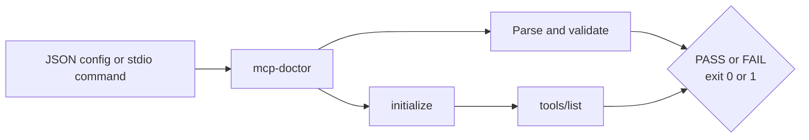

# mcp-doctor

[](https://github.com/jonah-ux/mcp-doctor/actions/workflows/ci.yml)
[](https://pypi.org/project/mcp-doctor/)

A minimal, dependency-free health check for [Model Context Protocol](https://modelcontextprotocol.io/) stdio servers. It catches malformed JSON configuration and verifies the two protocol steps most likely to fail before an agent can use a server: `initialize` and `tools/list`.

> v0.1.0 is intentionally small: it is a diagnostic, not an MCP client or a security scanner.



## The 30-second demo

```console
$ python -m pip install mcp-doctor
$ mcp-doctor config demo/mcp.json
PASS  demo/mcp.json
  [PASS] json: valid JSON
  [PASS] servers: found 1 server configuration(s)
  [PASS] server:demo: command configured: python

$ mcp-doctor server python demo/fake_server.py
PASS  python demo/fake_server.py
  [PASS] initialize: server accepted MCP initialization
  [PASS] tools/list: server listed 1 tool(s)
```

The repository demo is runnable without a network or external service:

```console
$ git clone https://github.com/jonah-ux/mcp-doctor.git
$ cd mcp-doctor
$ python -m venv .venv && . .venv/bin/activate
$ python -m pip install -e '.[test]'
$ ./demo/run.sh
```

## What it checks

| Command | Checks | Exit code |
| --- | --- | --- |
| `mcp-doctor config path/to/mcp.json` | JSON syntax, `mcpServers`/`servers` shape, command and args | `0` on pass, `1` on failure |
| `mcp-doctor server COMMAND [ARGS...]` | framed JSON-RPC `initialize`, `notifications/initialized`, `tools/list` | `0` on pass, `1` on failure |

Use `--json` on either command for automation:

```console
$ mcp-doctor config demo/mcp.json --json
{
  "checks": [
    {
      "message": "valid JSON",
      "name": "json",
      "status": "pass"
    },
    {
      "message": "found 1 server configuration(s)",
      "name": "servers",
      "status": "pass"
    },
    {
      "message": "command configured: python",
      "name": "server:demo",
      "status": "pass"
    }
  ],
  "ok": true,
  "target": "demo/mcp.json"
}
```

Output is deliberately plain and stable. The tool never sends credentials, calls a remote API, or modifies the server's files. The server subprocess is terminated after the probe.

## Install and develop

Requires Python 3.9+.

```console
python -m pip install mcp-doctor
python -m pip install -e '.[test]'
python -m pytest -q
```

The package has no runtime dependencies. CI tests Python 3.9, 3.11, and 3.12 on every push and pull request.

## Scope and limitations

- v0.1.0 supports stdio transport only; it does not connect to HTTP/SSE servers.
- Config validation checks command shape, not whether a command is installed.
- The protocol probe uses a short, bounded timeout and does not invoke tools.
- Run untrusted server commands only in an environment where you trust their side effects.

## License

MIT. See [LICENSE](LICENSE).
