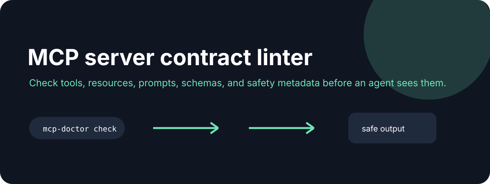

# MCP Doctor



**Check tools, resources, prompts, schemas, and safety metadata before an agent sees them.**

[](https://github.com/jonah-ux/mcp-doctor/actions/workflows/ci.yml)
[](https://www.python.org/)
[](LICENSE)

MCP Doctor is a small, offline-friendly CLI for catching missing names, descriptions,
input schemas, and timeouts in an MCP server manifest. It emits stable diagnostic codes
for humans and machine callers, so a CI job or coding agent can act on the same result.

## Try it in 30 seconds

```bash
git clone https://github.com/jonah-ux/mcp-doctor.git
cd mcp-doctor
python3 -m venv .venv
. .venv/bin/activate
python3 -m pip install .
mcp-doctor check examples/valid-server.json
```

```text
MCP Doctor 0.3.0
ok contract passed (1 tools, 1 resources, 1 prompts)
```

Try the failing fixture to see actionable diagnostics:

```bash
mcp-doctor check examples/invalid-server.json
mcp-doctor check examples/valid-server.json --json
mcp-doctor check examples/valid-server.json --baseline examples/valid-server.json --json
```

The JSON schema is intentionally tiny and stable:

```json
{"schema":"mcp-doctor/v1","ok":true,"findings":[],"counts":{"tools":1,"resources":1,"prompts":1},"fingerprint":"...","baseline":null}
```

## Agent-friendly usage

Pass `-` to read a manifest from stdin. Use `--strict` when a missing timeout should fail CI;
otherwise it is reported as a warning. Exit codes are `0` for a clean or warning-only report,
`1` for contract findings, and `2` for unreadable or malformed input.

JSON is parsed strictly: `NaN` and `Infinity` are rejected instead of being
treated as numbers. A timeout must also be finite and greater than zero;
non-finite timeout values produce the stable `MCP009` finding.

```bash
cat server.json | mcp-doctor check - --strict --json
```

Use `--baseline=PATH` to compare a manifest with a saved contract fingerprint.
The report exposes only stable entry names and SHA-256 digests, plus added,
removed, and changed entries. Drift is a warning by default; add
`--fail-on-drift` to make it fail CI with exit code `1`.

## See it work

The demo shows both sides of the contract: a clean manifest passes, while a missing description and timeout fail with stable diagnostic codes.

```text
MCP Doctor 0.3.0
ok contract passed (1 tools, 1 resources, 1 prompts)

x MCP002 search: tool needs a non-empty description
! MCP004 search: declare a positive timeout
```

## Open the contract walkthrough

The [MCP contract walkthrough](docs/walkthrough.html) is a standalone, dependency-free inspection
desk for a valid manifest, missing descriptions, missing timeouts, and baseline drift. Its buttons
show a synthetic browser model only; the command panel is the reproducible path against the real
CLI. No server is contacted and no provider behavior is implied.

## Related tools

Use [Agent Policy](https://github.com/jonah-ux/agent-policy) for capability decisions, [Agent Eval Kit](https://github.com/jonah-ux/agent-eval-kit) for repeatable command fixtures, and [Agent Proof](https://github.com/jonah-ux/agent-proof) to retain the diagnostic result.

## Development

```bash
python -m unittest discover -s tests
python -m build --sdist --wheel
python demos/demo.py
```

Read the [release guide](docs/releasing.md) before publishing. The project does not claim
permissions, isolation, verification, or provider behavior beyond the fields it can prove.

MIT licensed. Contributions and sanitized bug reports are welcome.
